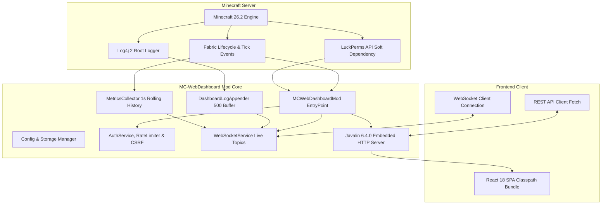

# MC-WebDashboard Architecture Documentation

## 1. Overview & System Design

**MC-WebDashboard** is an enterprise-grade, server-side Fabric mod for **Minecraft 26.2** running on **Java 25**. It embeds a lightweight, high-performance web server directly into the Minecraft server process to provide real-time telemetry, player management, console streaming, and administrative controls without external agent dependencies.

---

## 2. Core Subsystems

### 2.1 Server Lifecycle Integration
The mod hooks directly into Fabric's lifecycle events:
- `ServerLifecycleEvents.SERVER_STARTING`: Initializes configuration, creates default JSON file if missing, starts the embedded Javalin web server, registers WebSocket endpoints, registers the Log4j appender, and attaches the active server instance.
- `ServerLifecycleEvents.SERVER_STOPPED`: Disconnects all active WebSocket sessions gracefully, shuts down the asynchronous executor service, flushes log buffers, and cleanly stops Javalin.
- `ServerTickEvents.END_SERVER_TICK`: Calculates tick duration (MSPT) and rolling ticks-per-second (TPS) without interrupting tick execution.
- `ServerPlayConnectionEvents.JOIN` & `DISCONNECT`: Notifies the `PlayerTrackerService` and broadcasts join/leave events via WebSockets and the activity feed.

### 2.2 Metrics & Telemetry Engine
To comply with the target overhead of **< 1 ms average tick latency** and **< 5 MB baseline memory footprint**:
- Metrics are sampled once per second by a dedicated background `ScheduledExecutorService`.
- Measurements include:
  - Rolling TPS (calculated from nanosecond server tick intervals)
  - MSPT (per-tick compute duration)
  - Operating system and process CPU percentages via Java MXBeans (`com.sun.management.OperatingSystemMXBean`)
  - JVM Memory pools: Heap Used, Committed, Max, and Non-Heap (Metaspace/Native)
  - Thread counts and Garbage Collection pause cycles
- Metrics are buffered in thread-safe sliding ring buffers maintaining:
  - 1-minute high-resolution history (60 samples)
  - 1-hour medium-resolution history (60 samples, sampled every minute)
  - 24-hour long-term history (96 samples, sampled every 15 minutes)

### 2.3 Soft-Dependency LuckPerms Adapter
MC-WebDashboard features first-class LuckPerms support while remaining strictly a **soft dependency**:
- The mod checks `FabricLoader.getInstance().isModLoaded("luckperms")`. If absent, all features remain 100% operational with a robust vanilla operator fallback.
- If LuckPerms is installed, the mod accesses `net.luckperms.api.LuckPermsProvider.get()` reflectively or safely at runtime.
- It parses user metadata (`CachedMetaData`) to extract prefixes, suffixes, custom meta attributes, and group weights.
- It dynamically subscribes to LuckPerms event bus (e.g. `UserDataRecalculateEvent`, `GroupDataRecalculateEvent`) to broadcast real-time permission and prefix changes over `/ws/luckperms`.
- It formats prefixes and titles with full support for:
  - MiniMessage formatting tags (`<red>`, `<bold>`, `<gradient:#ff0000:#0000ff>`)
  - Adventure formatting
  - Legacy section color codes (`§a`, `§6`, `§r`) and ampersand color codes (`&e`)
  - Hex RGB colors (`#ffffff`, `&#123456`)

### 2.4 Custom Log4j 2 Appender
- `DashboardLogAppender` attaches directly to Log4j 2's root configuration at server startup.
- Captures console output across all levels (`INFO`, `WARN`, `ERROR`, `DEBUG`).
- Stores the last 500 log events in an in-memory thread-safe `ConcurrentLinkedDeque`.
- Asynchronously broadcasts new log entries in real-time to all connected clients on `/ws/logs`.
- Provides an HTTP endpoint `/api/logs/download` to export raw console logs as `.log` files.

### 2.5 Security & Authentication Architecture
- **BCrypt Hashing**: Passwords are saved as salted hashes with cost factor 12 using `at.favre.lib:bcrypt`.
- **First-Run Setup Wizard**: If `passwordHash` is empty in `config/mc-webdashboard.json`, all routes redirect to an onboarding wizard where the administrator creates initial credentials. The dashboard remains locked until setup is complete.
- **Session Management**: Authenticated sessions issue cryptographically secure random session tokens stored in in-memory token maps with configurable TTL (default: 1440 minutes / 24 hours).
- **HttpOnly Secure Cookies**: Session IDs are delivered in `DASHBOARD_SESSION` cookies configured with `HttpOnly; SameSite=Strict; Path=/`.
- **CSRF Token Validation**: State-changing operations (POST, PUT, DELETE) require a cryptographically generated `X-CSRF-Token` header.
- **Brute-Force Rate Limiting**: IP-based rate limiter blocks client IPs after 5 failed authentication attempts within 5 minutes.

---

## 3. Concurrency & Thread Safety

Minecraft is inherently single-threaded for game state modifications. MC-WebDashboard strictly adheres to Minecraft's thread boundaries:
1. **Asynchronous HTTP/WebSocket Handling**: Javalin and WebSockets run on their own lightweight thread pools and never block the main Minecraft server tick thread.
2. **Safe Game Thread Delegation**: All state-modifying player actions (kick, ban, kill, operator promotion, teleportation, chat broadcast) are queued and executed on the Minecraft game thread using `server.execute(() -> { ... })`.
3. **Lock-Free Read Operations**: Live statistics and read queries rely on atomic primitives (`AtomicLong`, `AtomicReference`), volatile fields, and non-blocking concurrent collections (`ConcurrentHashMap`, `ConcurrentLinkedDeque`).
